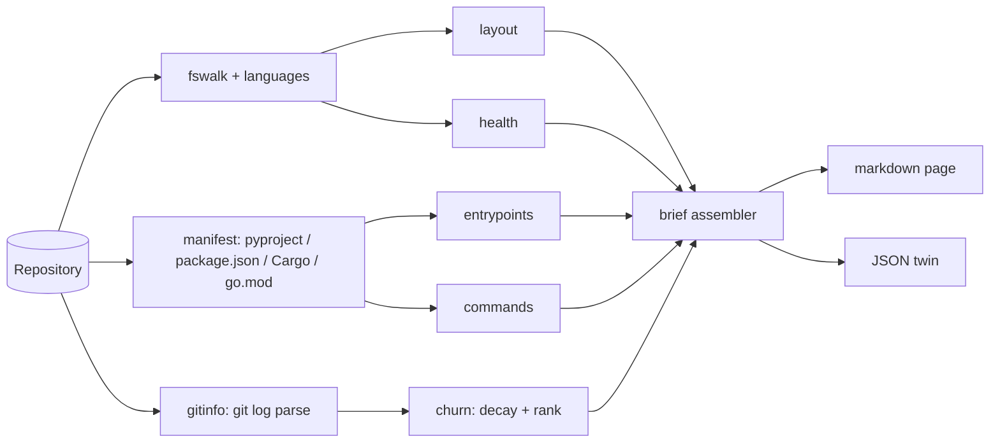

# repobrief

[English](README.md) | [中文](README.zh.md) | [日本語](README.ja.md)

[](LICENSE) [](CHANGELOG.md) [](pyproject.toml)  [](CONTRIBUTING.md)

**任意のリポジトリから 1 ページのオリエンテーション・ブリーフを生成：レイアウト、変更頻度順のホットファイル、エントリポイント、コマンド——引き継ぎのために設計。**


```bash
git clone https://github.com/JaydenCJ/repobrief && cd repobrief && pip install -e .
```

> **プレリリース:** repobrief はまだ PyPI に公開されていません。最初のリリースまでは、[JaydenCJ/repobrief](https://github.com/JaydenCJ/repobrief) を clone してリポジトリ直下で `pip install -e .` を実行してください。インストールせずに `PYTHONPATH=src python3 -m repobrief` として素の checkout から動かすこともできます。ランタイム依存がゼロだからです。

## なぜ repobrief なのか

リポジトリを新しいメンバー——あるいは AI coding agent——に引き継ぐとき、最初の疑問はいつも同じ 3 つです：コードはどこにあるか、実行はどこから始まるか、*いま*何が活発に変更されているか。README は古びていき、`tree` の出力は何も語らず、見栄え重視の統計ツールはこの 3 つに一切答えません。repobrief はプレーンな markdown 1 ページで全部に答えます：用途注釈付きレイアウト、そのまま貼れる実行コマンド付きエントリポイント、抽出されたタスクコマンド、そして「時間減衰付き git 変更頻度」で順位付けしたホットファイル——今月毎日編集されているファイルは、2 年前の書き直しで叩かれたファイルより重要だからです。agent には `repobrief --json .` を向ければ、同じブリーフが構造化データとして手に入ります。

|  | repobrief | onefetch | cloc / tokei | tree |
|---|---|---|---|---|
| 引き継ぎ向けの出力 | Markdown ブリーフ + JSON | ターミナルアート | 集計テーブル | 生の階層 |
| 変更頻度順のホットファイル | あり（時間減衰） | なし | なし | なし |
| エントリポイントと実行コマンド | あり、エコシステム横断 | なし | なし | なし |
| ディレクトリ用途の注釈 | あり | なし | なし | なし |
| git なしの素のディレクトリ対応 | あり（優雅に縮退） | なし（git 必須） | あり | あり |
| ランタイム依存 | 0 | コンパイル済みバイナリ | コンパイル済みバイナリ | システムツール |

<sub>スコープ確認（2026-07）：onefetch 2.24 はリポジトリ統計を言語ロゴの横にターミナルアートとして描画し、cloc/tokei は言語別に行数を数えます。どれも良いツールですが——実用的なオリエンテーション文書を出すものはありません。repobrief の依存数は [pyproject.toml](pyproject.toml) の `dependencies = []` に対応します。</sub>

## 特徴

- **1 ページ、そのまま引き継ぎへ** — レイアウト、エントリポイント、コマンド、ホットファイル、健全性チェックを 1 つの markdown 文書に。`BRIEF.md` としてコミットしても issue に貼ってもよい。
- **変更頻度順のホットファイル** — 各 commit がファイルの熱量に `0.5^(age/half-life)` を加算し、順位は*いま*の作業の重心を追跡。削除済み・リネームで消えたパスは除外し、生の commit 数と作者数も正直に併記。
- **エコシステム横断のエントリポイント検出** — pyproject console scripts、`__main__.py` パッケージ、`package.json` の `bin`/`main`、Cargo `[[bin]]`、Go の `cmd/*/main.go`（`package main` を検証）、Dockerfile `ENTRYPOINT`、Procfile——それぞれに実行コマンド付き。
- **出所付きのコマンド一覧** — npm scripts、Makefile ターゲット（`## desc` 規約）、justfile レシピ、`scripts/*.sh`、さらにツールチェーンから推定したコマンドを、由来ラベル付きで列挙。
- **決定的かつ完全オフライン** — ランタイム依存ゼロ、ネットワークなし、テレメトリなし。`--now` を固定すれば 2 回の実行はバイト単位で一致し、ブリーフを CI で diff できます。
- **機械可読の双子出力** — `--json` はキーがソートされ schema が安定した完全なブリーフを出力（[docs/brief-format.md](docs/brief-format.md)）。agent やダッシュボード向け。

## クイックスタート

インストールしたら、任意のリポジトリに向けるだけです：

```bash
repobrief .                 # brief for the current repo, on stdout
repobrief . --out BRIEF.md  # write it to a file instead
repobrief . --json          # same brief, structured
```

まずは同梱の決定的なプレイグラウンドで試すこともできます：

```bash
python examples/build_playground.py /tmp/playground
repobrief /tmp/playground --now 1751500800 --top 3
```

実際にキャプチャした出力（中間セクションは `...` で省略）：

```text
# Repo brief: acme-relay

> Webhook relay that fans events out to local consumers

- **Files:** 12 · **Lines:** 62 · **Size:** 1.5 KiB · **Primary language:** JavaScript (40%)
- **Git:** branch `main` · 8 commits · last commit yesterday · 3 authors in the last 8 commits
...
## Entry points

| Kind | Name | Where | Run |
|------|------|-------|-----|
| node main | `src/relay.js` | `src/relay.js` | `node src/relay.js` |
| docker | `ENTRYPOINT ["node", "src/relay.js"]` | `Dockerfile` | `docker build -t app . && docker run app` |
...
## Hot files (churn-ranked)

| # | File | Commits | Authors | Last touched | Heat |
|---|------|--------:|--------:|--------------|------|
| 1 | `src/relay.js` | 5 | 3 | yesterday | ████████ |
| 2 | `src/routes.js` | 3 | 2 | 3 weeks ago | ███ |
| 3 | `src/queue.js` | 2 | 2 | 3 days ago | ███ |
...
```

## CLI リファレンス

| フラグ | デフォルト | 効果 |
|---|---|---|
| `--json` | オフ | markdown の代わりに JSON を出力（schema は [docs/brief-format.md](docs/brief-format.md)） |
| `-o, --out FILE` | stdout | ブリーフをファイルへ書き出す |
| `--top N` | 10 | 順位付けするホットファイルの数 |
| `--depth N` | 2 | レイアウト表のディレクトリ深さ |
| `--half-life DAYS` | 30 | 熱量減衰の半減期。小さいほど直近の作業を重視 |
| `--max-commits N` | 400 | 熱量スキャンに使う直近 commit 数 |
| `--no-git` | オフ | git を完全にスキップ（履歴ヘッダもホットファイルもなし） |
| `--now EPOCH` | 実時刻 | 参照時刻を固定して出力を再現可能に |

ホットファイルの採点を一行で：ファイルに触れた各 commit が `0.5 ** (age_days / half_life)` を加算し、同点は生の commit 数、次にパスで解決。merge commit は除外され、作業ツリーに現存するファイルだけが順位付けされます。git 履歴のないリポジトリでも他の全セクションは維持され、ホットファイル欄にはその旨が正直に書かれます。

## 検証

このリポジトリは CI を同梱しません。上記の主張はすべてローカル実行で検証しています。このリポジトリの checkout から再現できます：

```bash
pip install -e '.[dev]' && pytest && bash scripts/smoke.sh
```

出力（実際の実行から転記、`...` で省略）：

```text
90 passed in 3.70s
...
[json] name/hot_files/git/commands all match
SMOKE OK
```

## アーキテクチャ



## ロードマップ

- [x] ウォーカー、熱量ランキング、エントリポイント/コマンド検出、レイアウト注釈、健全性チェック、markdown + JSON レンダリング、CLI（v0.1.0）
- [ ] PyPI 公開（`pip install repobrief`）
- [ ] `--diff` モード：2 つのブリーフを比較し、前回の引き継ぎ以降の変化を要約
- [ ] 所有権ヒント：同じ熱量スキャンからディレクトリごとの主要作者を提示
- [ ] Monorepo モード：workspace/package ごとにサブブリーフを生成

全リストは [open issues](https://github.com/JaydenCJ/repobrief/issues) を参照してください。

## コントリビュート

コントリビューションを歓迎します——まずは [good first issue](https://github.com/JaydenCJ/repobrief/issues?q=is%3Aissue+is%3Aopen+label%3A%22good+first+issue%22) から始めるか、[discussion](https://github.com/JaydenCJ/repobrief/discussions) を開いてください。開発環境の構築は [CONTRIBUTING.md](CONTRIBUTING.md) を参照。

## ライセンス

[MIT](LICENSE)
