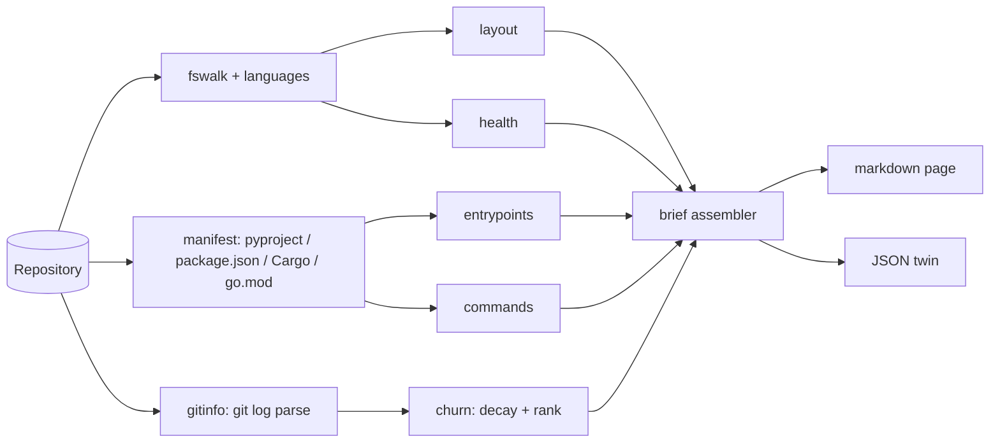

# repobrief

[English](README.md) | [中文](README.zh.md) | [日本語](README.ja.md)

[](LICENSE) [](CHANGELOG.md) [](pyproject.toml)  [](CONTRIBUTING.md)

**Generate a one-page orientation brief for any repo: layout, churn-ranked hot files, entry points, commands — built for handoffs.**


```bash
git clone https://github.com/JaydenCJ/repobrief && cd repobrief && pip install -e .
```

> **Pre-release:** repobrief is not yet published to PyPI. Until the first release, clone [JaydenCJ/repobrief](https://github.com/JaydenCJ/repobrief) and run `pip install -e .` from the repository root — or skip installing entirely: `PYTHONPATH=src python3 -m repobrief` works from a plain checkout because there are zero runtime dependencies.

## Why repobrief?

Handing a repository to a new teammate — or to an AI coding agent — starts with the same three questions: where is the code, where does execution start, and what is being worked on *right now*. READMEs go stale, `tree` dumps say nothing, and pretty-stats tools answer none of the three. repobrief answers them in one page of plain markdown: an annotated layout, detected entry points with copy-pasteable run commands, extracted task-runner commands, and hot files ranked by recency-decayed git churn — because the file edited every day this month matters more than the one hammered during a rewrite two years ago. Point an agent at `repobrief --json .` and it gets the same brief as structured data.

|  | repobrief | onefetch | cloc / tokei | tree |
|---|---|---|---|---|
| Output built for handoffs | Markdown brief + JSON | Terminal art | Count tables | Raw hierarchy |
| Churn-ranked hot files | Yes (recency-decayed) | No | No | No |
| Entry points & runnable commands | Yes, cross-ecosystem | No | No | No |
| Directory purpose annotation | Yes | No | No | No |
| Works on plain directories (no git) | Yes (degrades gracefully) | No (requires git) | Yes | Yes |
| Runtime dependencies | 0 | compiled binary | compiled binary | system tool |

<sub>Scope check, 2026-07: onefetch 2.24 renders repository statistics as terminal eye-candy next to a language logo; cloc/tokei count lines by language. All are fine tools — none produces an actionable orientation document. repobrief's dependency count is `dependencies = []` in [pyproject.toml](pyproject.toml).</sub>

## Features

- **One page, ready to hand off** — layout, entry points, commands, hot files, and health checks in a single markdown document you can commit as `BRIEF.md` or paste into an issue.
- **Churn-ranked hot files** — every commit contributes `0.5^(age/half-life)` to a file's heat, so the ranking tracks where work happens *now*; deleted and renamed-away paths are filtered out, and raw commit/author counts stay visible.
- **Entry points across ecosystems** — pyproject console scripts, `__main__.py` packages, `package.json` `bin`/`main`, Cargo `[[bin]]`, Go `cmd/*/main.go` (verified `package main`), Dockerfile `ENTRYPOINT`, Procfile — each with the exact command to run it.
- **Commands with provenance** — npm scripts, Makefile targets (`## desc` convention), justfile recipes, `scripts/*.sh`, plus inferred toolchain commands, each labeled with where it came from.
- **Deterministic and offline** — zero runtime dependencies, no network, no telemetry; pin `--now` and two runs are byte-for-byte identical, which makes briefs diffable in CI.
- **Machine-readable twin** — `--json` emits the full brief with sorted keys and a stable schema ([docs/brief-format.md](docs/brief-format.md)) for agents and dashboards.

## Quickstart

Install, then point it at any repository:

```bash
repobrief .                 # brief for the current repo, on stdout
repobrief . --out BRIEF.md  # write it to a file instead
repobrief . --json          # same brief, structured
```

Or try the bundled deterministic playground first:

```bash
python examples/build_playground.py /tmp/playground
repobrief /tmp/playground --now 1751500800 --top 3
```

Real captured output (middle sections elided with `...`):

```text
# Repo brief: acme-relay

> Webhook relay that fans events out to local consumers

- **Files:** 12 · **Lines:** 62 · **Size:** 1.5 KiB · **Primary language:** JavaScript (40%)
- **Git:** branch `main` · 8 commits · last commit yesterday · 3 authors in the last 8 commits
...
## Entry points

| Kind | Name | Where | Run |
|------|------|-------|-----|
| node main | `src/relay.js` | `src/relay.js` | `node src/relay.js` |
| docker | `ENTRYPOINT ["node", "src/relay.js"]` | `Dockerfile` | `docker build -t app . && docker run app` |
...
## Hot files (churn-ranked)

| # | File | Commits | Authors | Last touched | Heat |
|---|------|--------:|--------:|--------------|------|
| 1 | `src/relay.js` | 5 | 3 | yesterday | ████████ |
| 2 | `src/routes.js` | 3 | 2 | 3 weeks ago | ███ |
| 3 | `src/queue.js` | 2 | 2 | 3 days ago | ███ |
...
```

## CLI reference

| Flag | Default | Effect |
|---|---|---|
| `--json` | off | Emit JSON instead of markdown (schema: [docs/brief-format.md](docs/brief-format.md)) |
| `-o, --out FILE` | stdout | Write the brief to a file |
| `--top N` | 10 | Number of hot files to rank |
| `--depth N` | 2 | Directory depth of the layout table |
| `--half-life DAYS` | 30 | Churn decay half-life; smaller favors very recent work |
| `--max-commits N` | 400 | Recent commits fed into the churn scan |
| `--no-git` | off | Skip git entirely (no history header, no hot files) |
| `--now EPOCH` | wall clock | Pin the reference time for reproducible output |

Hot-file scoring in one line: each commit touching a file adds `0.5 ** (age_days / half_life)`, ties break on raw commit count then path, merge commits are skipped, and only files still present in the work tree are ranked. Repositories without git history keep every other section and say so honestly in the hot-files slot.

## Verification

This repository ships no CI; every claim above is verified by local runs. Reproduce them from a checkout of this repository:

```bash
pip install -e '.[dev]' && pytest && bash scripts/smoke.sh
```

Output (copied from a real run, truncated with `...`):

```text
90 passed in 3.70s
...
[json] name/hot_files/git/commands all match
SMOKE OK
```

## Architecture



## Roadmap

- [x] Walker, churn ranking, entry-point/command detection, layout annotation, health checks, markdown + JSON rendering, CLI (v0.1.0)
- [ ] PyPI release with `pip install repobrief`
- [ ] `--diff` mode: compare two briefs and summarize what moved since the last handoff
- [ ] Ownership hints: per-directory dominant authors from the same churn scan
- [ ] Monorepo mode: one sub-brief per workspace/package

See the [open issues](https://github.com/JaydenCJ/repobrief/issues) for the full list.

## Contributing

Contributions are welcome — start with a [good first issue](https://github.com/JaydenCJ/repobrief/issues?q=is%3Aissue+is%3Aopen+label%3A%22good+first+issue%22) or open a [discussion](https://github.com/JaydenCJ/repobrief/discussions). See [CONTRIBUTING.md](CONTRIBUTING.md) for the development setup.

## License

[MIT](LICENSE)
