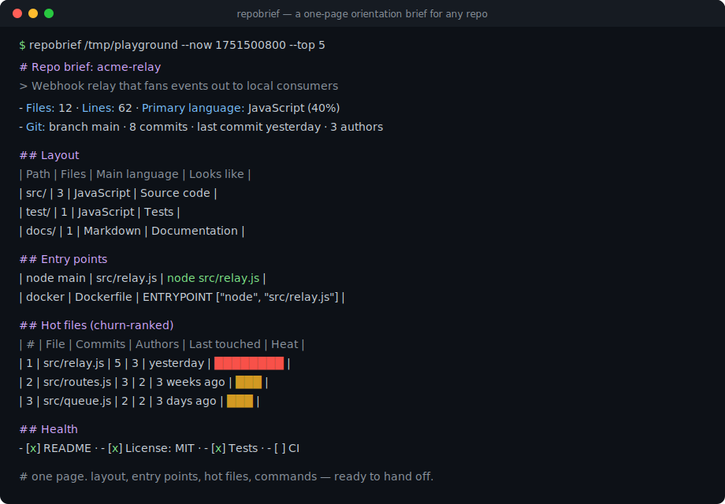
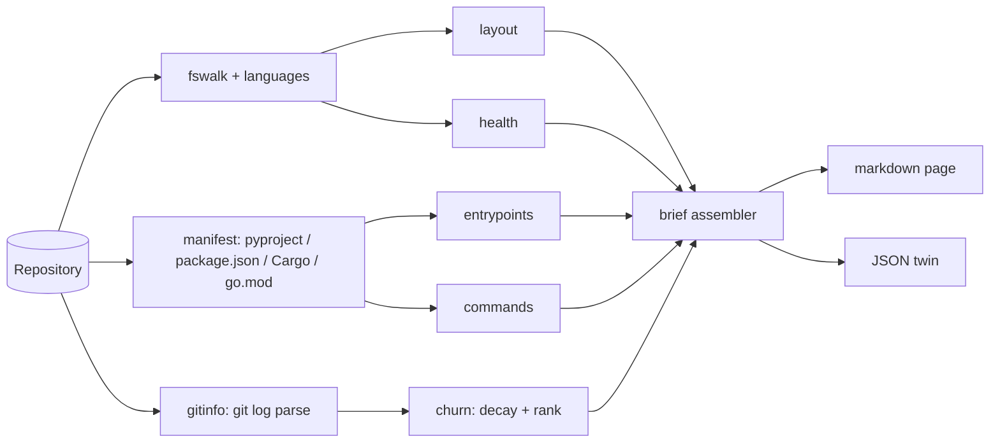

# repobrief

[English](README.md) | [中文](README.zh.md) | [日本語](README.ja.md)

[](LICENSE) [](CHANGELOG.md) [](pyproject.toml)  [](CONTRIBUTING.md)

**为任意仓库生成一页式导览简报：目录结构、按变更热度排序的热点文件、入口点、可运行命令——专为交接而生。**



```bash
git clone https://github.com/JaydenCJ/repobrief && cd repobrief && pip install -e .
```

> **预发布：** repobrief 尚未发布到 PyPI。在首个正式版之前，请 clone [JaydenCJ/repobrief](https://github.com/JaydenCJ/repobrief) 并在仓库根目录执行 `pip install -e .`——也可以完全不安装：`PYTHONPATH=src python3 -m repobrief` 在裸 checkout 上就能运行，因为它没有任何运行时依赖。

## 为什么选 repobrief？

把一个仓库交给新同事——或交给一个 AI coding agent——总是从同样三个问题开始：代码在哪里、从哪里启动、*现在*大家正在改什么。README 会过时，`tree` 的输出什么都说明不了，而炫酷统计工具对这三个问题一个也答不上。repobrief 用一页纯 markdown 全部回答：带用途标注的目录结构、附可直接粘贴运行命令的入口点、提取出的任务命令，以及按“时间衰减的 git 变更热度”排序的热点文件——本月每天都在改的文件，远比两年前大重构时狂改过的文件重要。让 agent 跑一句 `repobrief --json .`，同样的简报就变成结构化数据。

|  | repobrief | onefetch | cloc / tokei | tree |
|---|---|---|---|---|
| 面向交接的输出 | Markdown 简报 + JSON | 终端画报 | 计数表格 | 原始层级 |
| 按变更热度排序的热点文件 | 有（时间衰减） | 无 | 无 | 无 |
| 入口点与可运行命令 | 有，跨生态 | 无 | 无 | 无 |
| 目录用途标注 | 有 | 无 | 无 | 无 |
| 支持无 git 的普通目录 | 支持（优雅降级） | 不支持（必须有 git） | 支持 | 支持 |
| 运行时依赖 | 0 | 编译二进制 | 编译二进制 | 系统工具 |

<sub>范围核对（2026-07）：onefetch 2.24 把仓库统计渲染成语言 logo 旁的终端画报；cloc/tokei 按语言数行数。它们都是好工具——但没有一个能产出可执行的导览文档。repobrief 的依赖数对应 [pyproject.toml](pyproject.toml) 中的 `dependencies = []`。</sub>

## 特性

- **一页纸，直接交接** — 目录结构、入口点、命令、热点文件、健康检查，汇成一份 markdown 文档，可作为 `BRIEF.md` 提交入库或直接贴进 issue。
- **按变更热度排序的热点文件** — 每个 commit 为文件热度贡献 `0.5^(age/half-life)`，排名跟随*当下*的工作重心；已删除或改名后消失的路径会被过滤，原始 commit 数与作者数仍然如实展示。
- **跨生态的入口点检测** — pyproject console scripts、`__main__.py` 包、`package.json` 的 `bin`/`main`、Cargo `[[bin]]`、Go `cmd/*/main.go`（校验 `package main`）、Dockerfile `ENTRYPOINT`、Procfile——每一项都附带可直接运行的命令。
- **带出处的命令清单** — npm scripts、Makefile 目标（`## desc` 约定）、justfile recipes、`scripts/*.sh`，外加工具链推断命令，每条都标注来源。
- **确定性且完全离线** — 零运行时依赖、无网络、无遥测；固定 `--now` 后两次运行逐字节一致，简报因此可以在 CI 里做 diff。
- **机器可读的孪生输出** — `--json` 输出完整简报，键有序、schema 稳定（[docs/brief-format.md](docs/brief-format.md)），供 agent 与仪表盘消费。

## 快速上手

安装后指向任意仓库即可：

```bash
repobrief .                 # brief for the current repo, on stdout
repobrief . --out BRIEF.md  # write it to a file instead
repobrief . --json          # same brief, structured
```

也可以先试试内置的确定性演练场：

```bash
python examples/build_playground.py /tmp/playground
repobrief /tmp/playground --now 1751500800 --top 3
```

真实捕获的输出（中间部分用 `...` 省略）：

```text
# Repo brief: acme-relay

> Webhook relay that fans events out to local consumers

- **Files:** 12 · **Lines:** 62 · **Size:** 1.5 KiB · **Primary language:** JavaScript (40%)
- **Git:** branch `main` · 8 commits · last commit yesterday · 3 authors in the last 8 commits
...
## Entry points

| Kind | Name | Where | Run |
|------|------|-------|-----|
| node main | `src/relay.js` | `src/relay.js` | `node src/relay.js` |
| docker | `ENTRYPOINT ["node", "src/relay.js"]` | `Dockerfile` | `docker build -t app . && docker run app` |
...
## Hot files (churn-ranked)

| # | File | Commits | Authors | Last touched | Heat |
|---|------|--------:|--------:|--------------|------|
| 1 | `src/relay.js` | 5 | 3 | yesterday | ████████ |
| 2 | `src/routes.js` | 3 | 2 | 3 weeks ago | ███ |
| 3 | `src/queue.js` | 2 | 2 | 3 days ago | ███ |
...
```

## CLI 参考

| 选项 | 默认值 | 效果 |
|---|---|---|
| `--json` | 关 | 输出 JSON 而非 markdown（schema 见 [docs/brief-format.md](docs/brief-format.md)） |
| `-o, --out FILE` | stdout | 把简报写入文件 |
| `--top N` | 10 | 参与排名的热点文件数量 |
| `--depth N` | 2 | 目录结构表的目录深度 |
| `--half-life DAYS` | 30 | 热度衰减半衰期；越小越偏向最近的工作 |
| `--max-commits N` | 400 | 进入热度扫描的最近 commit 数 |
| `--no-git` | 关 | 完全跳过 git（无历史头信息、无热点文件） |
| `--now EPOCH` | 系统时钟 | 固定参考时间，保证输出可复现 |

热点文件评分一句话说清：每个触及文件的 commit 贡献 `0.5 ** (age_days / half_life)`，平分时按原始 commit 数再按路径排序，merge commit 被跳过，且只对仍存在于工作区的文件排名。没有 git 历史的仓库保留其余全部小节，并在热点文件位置如实说明。

## 验证

本仓库不附带 CI；以上每一条主张都由本地运行验证。在本仓库的 checkout 中即可复现：

```bash
pip install -e '.[dev]' && pytest && bash scripts/smoke.sh
```

输出（摘自真实运行，用 `...` 截断）：

```text
90 passed in 3.70s
...
[json] name/hot_files/git/commands all match
SMOKE OK
```

## 架构



## 路线图

- [x] 遍历器、热度排名、入口点/命令检测、目录标注、健康检查、markdown + JSON 渲染、CLI（v0.1.0）
- [ ] 发布到 PyPI，支持 `pip install repobrief`
- [ ] `--diff` 模式：对比两份简报，总结上次交接以来的变化
- [ ] 归属提示：基于同一次热度扫描给出各目录的主要作者
- [ ] Monorepo 模式：每个 workspace/package 一份子简报

完整列表见 [open issues](https://github.com/JaydenCJ/repobrief/issues)。

## 参与贡献

欢迎贡献——可以从 [good first issue](https://github.com/JaydenCJ/repobrief/issues?q=is%3Aissue+is%3Aopen+label%3A%22good+first+issue%22) 入手，或发起一个 [discussion](https://github.com/JaydenCJ/repobrief/discussions)。开发环境搭建见 [CONTRIBUTING.md](CONTRIBUTING.md)。

## 许可证

[MIT](LICENSE)
